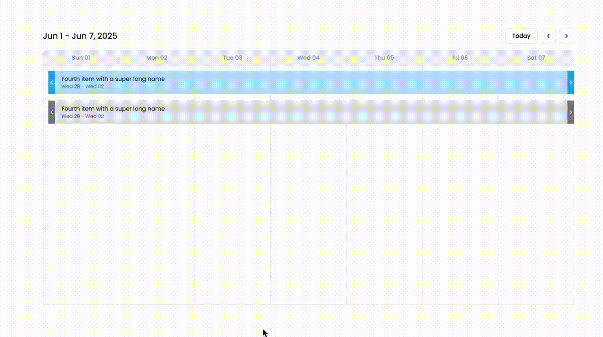

# React Beautiful Timeline

A React timeline component based on Notion's visual style and retro-style design using Tailwind CSS and Shadcn UI for Qloo interview process.


Table of Contents

- [Features](#features)
- [Usage](#usage)
- [Time spent](#time-spent)
- [How i created this](#how-i-created-this)
- [Interactive features](#interactive-features)


## Features

- [x] Retro-style design;
- [x] Well structured and easy to customize;
- [x] Performant and Lightweight;
- [x] Really good UI/UX;

## Usage

1. First make sure you have Node.js LTS installed, if you have nvm or asdf it may install automatically 
just by running a terminal inside the project folder.

2. Install dependencies

```bash
yarn install
```

3. Run the development server

```bash
yarn dev
```

4. Open your browser and navigate to http://localhost:3000 to see the app.


## Time spent

I've spent about 7 hours in this task, tracked using Toggl Track:


## How i created this

This is a component made for Qloo interview process.

I've started it by understanding what should i had to do, i created a notion page and documented the functional requirements that was asked. Then i started searching in Dribble and Figma Community for inspirations and examples. After it i started to plan my own functional requirements that i would like to bring in addition to the ones asked.

Then i started to code, i've started by using a boilerplate for Vite project that would bring me a lot of utilities like Linting, Formatting, TypeScript, Git Hooks, Tailwind Config, etc. For UI i choose Shadcn as well because it provided end-to-end accessibility support and a lot of components that i could use. And my process was first create a read only version of timeline with the fundamental features asked in instructions.md, such as creation of lanes, managing overlapping, displaying item name and date, and positioning it correctly over week days columns.

## Interactive features

### Display timeline items by week view;

I choose week view because month is too much info and day is too less. But in the future would be awesome to provide support for them.


### Continuity UX support;

How is a week view some items may contain several weeks, so i've added a button that can show before the item for those that started in the previous week and after it for those that will end in the next week or both, and by clicking on it it will go back to previous or next week:


### Week pagination and today button;

I've added pagination buttons to go back and forth between weeks, and a today button to go to the current week.



### Popover to edit item name and better visual feedback to improve user experience;

By Clicking on a item it will show a popover with the item name, detailed date, and clicking on the pencil icon it will allow to edit the item name.


