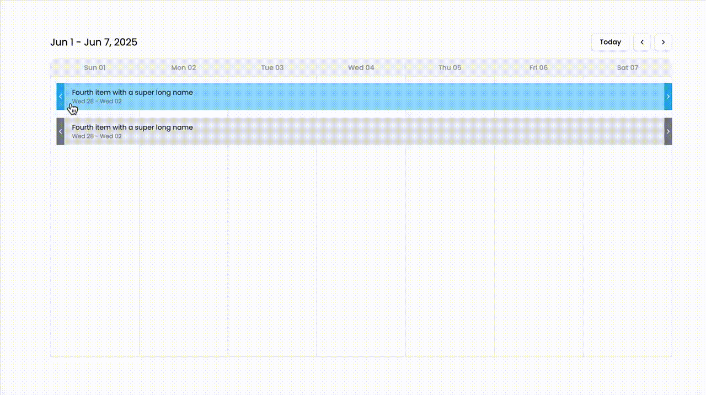

# React Beautiful Timeline

A React timeline component based on Notion's visual style and retro-style design using Tailwind CSS and Shadcn UI for Qloo interview process.


## Table of Contents
- [Features](#features)
- [Usage](#usage)
- [Time spent](#time-spent)
- [How i created this](#how-i-created-this)
- [Inspirations](#inspirations)
- [Project structure](#project-structure)
- [Interactive features](#interactive-features)
  - [Display timeline items by week view](#display-timeline-items-by-week-view)
  - [Continuity UX support](#continuity-ux-support)
  - [Week pagination and today button](#week-pagination-and-today-button)
  - [Popover to edit item name and better visual feedback to improve user experience](#popover-to-edit-item-name-and-better-visual-feedback-to-improve-user-experience)
- [What i would improve if i had more time](#what-i-would-improve-if-i-had-more-time)


## Features

- [x] Retro-style design;
- [x] Well structured and easy to customize;
- [x] Performant and Lightweight;
- [x] Really good UI/UX;

## Usage

1. First make sure you have Node.js LTS installed, if you have nvm or asdf it may install automatically 
just by running a terminal inside the project folder.

2. Install dependencies

```bash
yarn install
```

3. Run the development server

```bash
yarn dev
```

4. Open your browser and navigate to http://localhost:3000 to see the app.


## Time spent

I've spent about 7 hours in this task, tracked using Toggl Track:


## How i created this

I began by understanding the requirements of the project. To stay organized, I created a Notion page where I documented all the functional requirements that were provided. After that, I explored Dribbble and the Figma Community for inspiration and reference examples. Based on what I found, I started planning additional functional features I wanted to include beyond the original scope.

For development, I bootstrapped the project using a Vite boilerplate that included useful tooling such as linting, formatting, TypeScript, Git hooks, and Tailwind CSS configuration, it also has some others config that was not used like Storybook and Vitest. For the UI, I chose Shadcn because it offers accessible, ready-to-use components with solid end-to-end support.

My initial focus was to implement a read-only version of the timeline. I prioritized the core features outlined in the instructions.md, such as lane creation, overlapping item management, displaying item names and dates, and correctly positioning items across the weekly columns.

## Inspirations

- [Notion](https://www.notion.so/)
- [Defcon Timeline Figma Project](https://www.figma.com/design/AYEo0BNHKPhDUGoxeIGqju/Defcon---Calendar-Schedule-Timeline-dashboard--Community-?m=auto&t=mDVZKb8ZfPZZRgHi-6)


## Project structure

The components were organized using atomic [design pattern](https://atomicdesign.bradfrost.com/chapter-2/) in order to make it easier to maintain and extend. Also the principle of [colocation](https://kentcdodds.com/blog/colocation) was highly applied, making the structure easy to navigate and to make decisions.


So the main folder structure is:

```bash
src/
├── components/
│   ├── atom/ # Atoms are the smallest units of UI components, such as buttons, inputs, and text.
│   ├── molecule/ # Molecules are more complex components built from atoms, such as form fields, dropdowns, and modals.
│   └── organism/ # Organisms are larger components that combine multiple molecules and atoms, such as a header, footer, or sidebar.
│
├── helpers/ # Global Helper functions
│
├── styles/ # Global styles like theming.
│
└── pages/ # Pages are the main components that are used to build the app.
```

Other folders that may appear as the project grows are:

```bash
├── hooks/ # Global utility hooks
├── services/ # Global services like api calls
├── types/ # Global types
└── providers/ # Global providers like theme provider
└── store/ # Place to handle global state with tools like Redux, Zustand, etc.
```

## Interactive features

### Display timeline items by week view;

I choose week view because month is too much info and day is too less. But in the future would be awesome to provide support for them.


### Continuity UX support;

How is a week view some items may contain several weeks, so i've added a button that can show before the item for those that started in the previous week and after it for those that will end in the next week or both, and by clicking on it it will go back to previous or next week:



### Week pagination and today button;

I've added pagination buttons to go back and forth between weeks, and a today button to go to the current week.


### Popover to edit item name and better visual feedback to improve user experience;

By Clicking on a item it will show a popover with the item name, detailed date, and clicking on the pencil icon it will allow to edit the item name.


## What i would improve if i had more time

- [ ] I would use component composition pattern where the timeline component could be broken into smaller components and you could pick and choose and compose the timeline as you want offering highly customization.

- [ ] Make TimelineItem molecule more generic, i think it was a bad decision the way i created it coupled with a popover, it's too complex to be reused.

- [ ] Support for month view and day view;
- [ ] Support for timeline items creation / deletion;
- [ ] Component testing and end to end testing;
- [ ] Support for timeline items drag and drop;
- [ ] Support for timeline items resizing to change min/max duration;

- [ ] Improve the popover to be able to edit:
  - [ ] Start date;
  - [ ] End date;
  - [ ] Color;
  - [ ] Description;
- [ ] Publish as npm package;